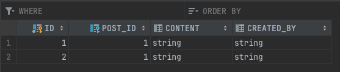
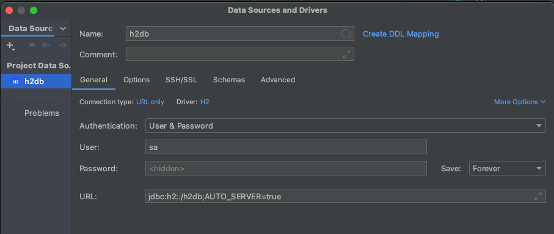
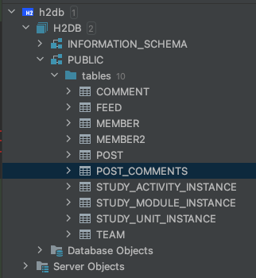

## 스터디 로그

## 일시

- 2024-04-16

## 참석자

## 주제
- mappedBy 속성 이해하기
- 연관관계 메서드 사용이유
- h2 데이터베이스 mixed mode 사용하기

### mappedBy 속성 이해하기 
Post와 Comment가 1: N 관계일때
```java
@Getter
@Entity
@AllArgsConstructor
@NoArgsConstructor
public class Comment {
    @Id
    @GeneratedValue(strategy = GenerationType.IDENTITY)
    private Long id;

    private String content;

    private String createdBy;

    @ManyToOne(fetch = FetchType.LAZY)
    private Post post;

    public static Comment of(Long id, String content, String createdBy) {
        Comment comment = new Comment();
        comment.id = id;
        comment.content = content;
        comment.createdBy = createdBy;
        return comment;
    }

    public void setPost(Post post) {
        this.post = post;
    }
}
```

연관관계메서드를 안쓰고도 Comment와 Post를 연관시킬 수 있습니다.

```java

@Service

@Transactional(readOnly = true)
public class CommentApplicationService {
    private final CommentJpaRepository commentRepository;

    private final PostJpaRepository postRepository;

    public CommentApplicationService(CommentJpaRepository commentRepository, PostJpaRepository postRepository) {
        this.commentRepository = commentRepository;
        this.postRepository = postRepository;
    }

    @Transactional
    public CommentResponse createComment(Long postId, CommentCreateRequest request) {
        Post postEntity = postRepository.findById(postId)
                .orElseThrow(() -> new IllegalArgumentException("Post not found"));
        Comment commentEntity = Comment.of(null, request.content(), request.createdBy());
        commentEntity.setPost(postEntity);

// postEntity.addComment(commentEntity);
        commentRepository.save(commentEntity);
        return CommentResponse.of(commentEntity);
    }
}
```
comment 테이블


Post 엔티티에 다음과 같이 Comment와 1: N 관계를 ORM에 저장합니다.
```java
    @OneToMany(mappedBy = "post", orphanRemoval = true, cascade = CascadeType.ALL)
    private List<Comment> comments = new ArrayList<>();
```

Comment 엔티티에는 다음과 같이 적용되어있습니다.
```java
    @ManyToOne(fetch = FetchType.LAZY)
    private Post post;
```

Post에 OneToMany를 구성하면 Post에서 Comment로 단방향 매핑이 되고 관계 테이블이 만들어집니다.
```java
//    @OneToMany(mappedBy = "post", orphanRemoval = true, cascade = CascadeType.ALL)
    @OneToMany
    private List<Comment> comments = new ArrayList<>();
```

post_comments라는 테이블이 생성되는것을 확인할 수 있습니다.
```shell
create table comment (id bigint generated by default as identity, post_id bigint, content varchar(255), created_by varchar(255), primary key (id))
create table post (id bigint generated by default as identity, content varchar(255), created_by varchar(255), title varchar(255), primary key (id))
create table post_comments (comments_id bigint not null unique, post_id bigint not null)
```

mappedBy를 사용하면 comment 테이블과 매핑이 되고 post_comments는 생성되지 않습니다.
```shell
create table comment (id bigint generated by default as identity, post_id bigint, content varchar(255), created_by varchar(255), primary key (id))
create table post (id bigint generated by default as identity, content varchar(255), created_by varchar(255), title varchar(255), primary key (id))
```

### 연관관계 메서드 사용이유

Post 엔티티에 연관관계 메서드를 생성했습니다. addComment 메서드입니다.
```java
@Getter
@Entity
public class Post {

    @Id
    @GeneratedValue(strategy = GenerationType.IDENTITY)
    private Long id;

    private String title;

    private String content;

    private String createdBy;

    @OneToMany(mappedBy = "post", orphanRemoval = true, cascade = CascadeType.ALL)
    private List<Comment> comments = new ArrayList<>();

    public static Post of(Long id, String title, String content, String createdBy) {
        Post post = new Post();
        post.id = id;
        post.title = title;
        post.content = content;
        post.createdBy = createdBy;
        return post;
    }

    public void update(String title, String content) {
        this.title = title;
        this.content = content;
    }

    public void addComment(Comment commentEntity) {
        comments.add(commentEntity);
        commentEntity.setPost(this);
    }
}
```

연관관계 메서드를 안써도 관계 매핑이 되는데 왜 쓰냐고요?
JPA를 사용하는 이유가 OOP와 RDBMS를 매핑하기 위해서 사용하는데, 객체지향적으로 사용하기 위해서 사용합니다.
Post와 Comment가 양방향 참조를 하는데 연관관계 메서드에 나온것처럼 당연히 매핑을 해줘야한다. 라는게 JPA의 관점입니다.
```java

@Service
@Transactional(readOnly = true)
public class CommentApplicationService {
    private final CommentJpaRepository commentRepository;

    private final PostJpaRepository postRepository;

    public CommentApplicationService(CommentJpaRepository commentRepository, PostJpaRepository postRepository) {
        this.commentRepository = commentRepository;
        this.postRepository = postRepository;
    }

    @Transactional
    public CommentResponse createComment(Long postId, CommentCreateRequest request) {
        Post postEntity = postRepository.findById(postId)
                .orElseThrow(() -> new IllegalArgumentException("Post not found"));
        Comment commentEntity = Comment.of(null, request.content(), request.createdBy());
        commentEntity.setPost(postEntity);
        postEntity.addComment(commentEntity);
//        commentRepository.save(commentEntity);
        return CommentResponse.of(commentEntity);
    }
}
```

참고: https://youtu.be/hsSc5epPXDs?si=XRlZuYW_4026AKmq

### h2 데이터베이스 mixed mode 사용하기

application.yml을 다음과 같이 수정했습니다.
```yml
spring:
  application:
    name: mildang-be-spring-study
  datasource:
#    url: jdbc:h2:mem:study  # In-memory H2 database
    url: jdbc:h2:./h2db;AUTO_SERVER=true  # In-memory H2 database
    username: sa
    password:
    driver-class-name: org.h2.Driver
  h2:
    console:
      enabled: true
#      path: /h2-console
  jpa:
    hibernate:
      ddl-auto: create-drop


logging:
  pattern:
    console: "[%d{HH:mm:ss.SSS}[%-5level][%logger.%method:line%line] - %msg%n"
  level:
    org:
      hibernate.orm.jdbc.bind: trace
      hibernate.SQL: debug

```

기존에 사용하던 방식은 Inmemory H2 database를 사용했습니다. 이번에는 mixed mode로 사용해보겠습니다.
mixed mode으로 사용하게되면 intellij로 h2 db를 접속할 수 있습니다. 

인텔리제이에서 h2 접근 





참고: https://www.h2database.com/html/features.html#auto_mixed_mode